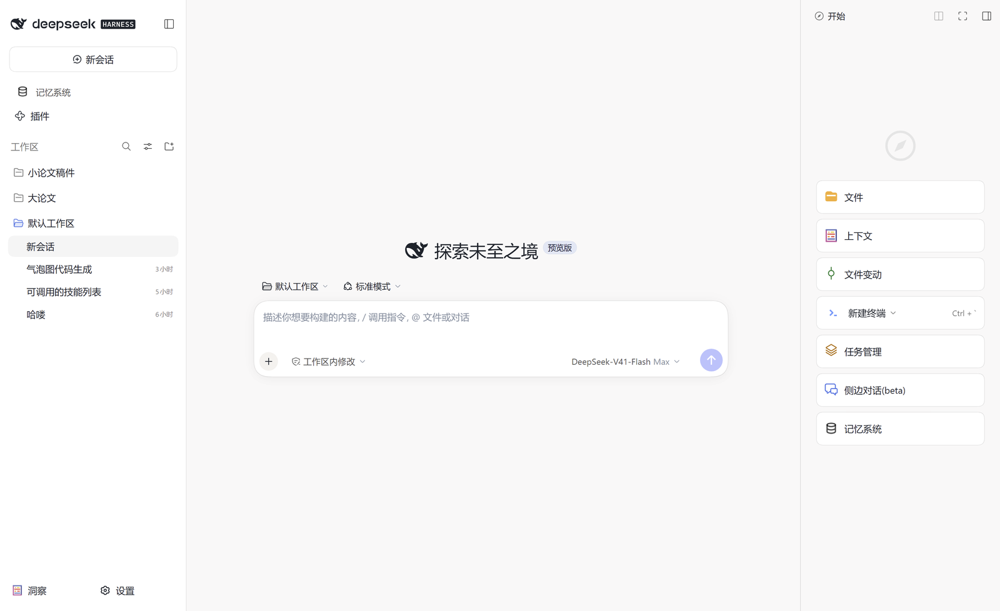
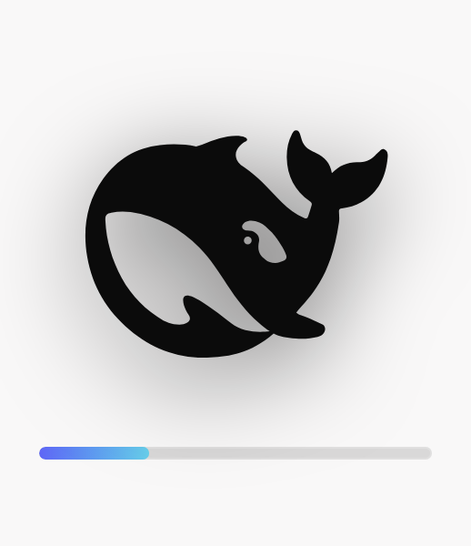
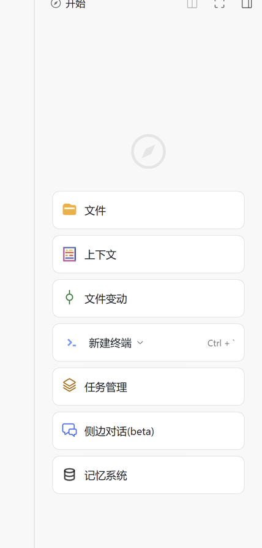
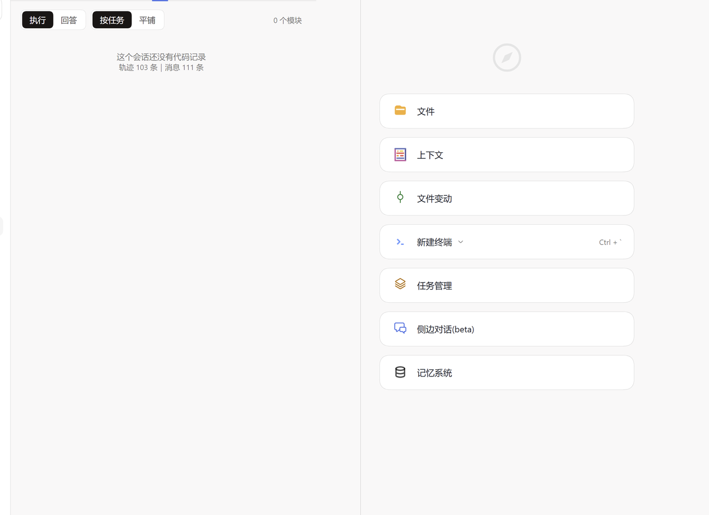

# DeepSeek Harness 桌面版（Windows）

把只提供网页版的 [DeepSeek Harness](https://www.deepseek.com/harness/)（下称 DSH）**封装成一个双击就能用的 Windows 桌面软件**，并附带三个自己写的 DSH 插件：官网风格主题、代码归档页签、删除对话。



---

## 一、为什么做这个

DSH 官方目前只有 Web 版：每次使用都要打开浏览器、输入地址、和一堆标签页混在一起；没有托盘图标、没有原生窗口按钮，关掉浏览器就等于关掉工作台。

这个项目解决的就是这件事：**双击桌面图标 → 屏幕中央出现图标启动画面 → 直接进入主界面**，全程不碰浏览器。

## 二、功能一览

### 1. 桌面壳（`desktop/`）

| 功能 | 说明 |
| --- | --- |
| 图标式启动画面 | 屏幕正中只显示一个图标（黑底鲸鱼，白色部分透明）+ 进度条；主界面**渲染完成**才切换，启动画面同时消失，不出现"先白屏后加载"或"两个窗口重叠" |
| 原生窗口 | 放大 / 缩小 / 关闭按钮齐全，可自由拖拽调整大小，窗口位置和尺寸会记住 |
| 托盘常驻 | 关闭到托盘、托盘右键菜单（显示 / 隐藏 / 检查更新 / 退出） |
| 单实例 | 重复双击不会开出第二个窗口，而是把已有窗口唤到最前 |
| 启动前自清理 | 清掉上次异常退出残留的 dsh 服务与端口占用，避免"第二次打不开" |
| 右键菜单 | 选中文字→复制 / 复制为纯文本 / 全选；输入框→剪切 / 复制 / 粘贴；图片→复制图片；链接→打开 / 复制 |
| 检查更新 | 菜单栏「帮助 → 检查更新…」：对比 npm 上 DSH 核心与已装插件的版本，**只提示、不改动**，并可一键复制升级命令 |
| 免安装打包 | `build.ps1`（复制 Electron 运行时 + rcedit 打图标/版本号）或 `npm run package`（electron-packager） |

### 2. 插件 `dsh-harness-site` —— 官网风格主题 + 界面微调

- **设计变量对齐官网**：浅色 `#f9f8f8` 画布、近黑主按钮 `#1a1615`、品牌蓝链接 `#4d6bfe`；深色 `#0a0a0a` 画布、白按钮、`#6799fe`。深浅两套跟随官方「设置 → 外观」切换。
- 自己发出的消息气泡改成淡蓝底 + 蓝色描边（`#E8F0FE` + 蓝边），一眼能分辨。
- 侧栏底部「上下文洞察 / 设置」并排，并把长名字「上下文洞察」缩成「洞察」。
- **右侧面板宽度的全局记忆**：官方把宽度按*会话*存，换个会话就回到默认；插件把它镜像成全局值——拖一次，以后每个会话都按这个宽度。
- **右侧面板容器随内容自适应**：按钮变宽变窄，容器自动重算并收窄到刚好放得下（见下文「最麻烦的一段」）。
- 隐藏**聊天列两侧的宽度拖拽手柄**（官方 `dsh-client-ui-conversation` 的 `widthHandle`：10px 宽、整列高、`cursor:col-resize`）：鼠标扫过就会变成左右箭头、还能把聊天列拖宽拖窄，在「代码」页这种聊天列已隐藏的视图里特别容易误触 —— 只藏手柄本身、不动布局，右侧面板那根要保留的把手不受影响。

### 3. 插件 `dsh-code-history` —— 会话里的「代码」页签

在对话页签后面多出一个「代码」页签，把**这个会话里出现过的代码**自动整理成卡片。它不是简单罗列，而是先理解再归档：

| 能力 | 说明 |
| --- | --- |
| 两类分开 | **执行**：软件自己操作电脑时写下的代码；**回答**：我提问时它直接给我的代码 |
| 中文意图标题 | 20+ 条规则自动命名（如「气泡图代码」「数据清洗脚本」），双击可改名，点别处自动保存，也有「恢复」 |
| 卡片信息 | 语言、依赖（chips）、「输入→输出」流程条、运行状态（✅/❌/⚠️）、智能预览 |
| 一键复制 | 整体复制 / 选择性复制；也支持导出 Markdown |
| 按任务合并 | 同一任务的多段代码可合并成**一份能直接运行**的版本（import 去重、同名函数取最后一次） |
| 性能 | 原始类型订阅 + 500ms 防抖 + 跳过 reasoning 大文本；一次长会话的可视化任务从"点一下卡半天"改成秒开 |

### 4. 插件 `dsh-session-tools` —— 删除对话（不可恢复）

给左侧会话列表的每一行加了**垃圾桶按钮**（鼠标悬停时出现，和官方自带的重命名/归档按钮并排），点它弹出确认框，确认后删掉这个对话的**全部记录数据**。

| 要点 | 说明 |
| --- | --- |
| 为什么要单独做 | 官方客户端 API 里**没有**删除会话的方法（只有 `create` / `rename` / `archive` / `list` …），所以这件事只能在桌面壳这一层做 |
| 删除链路 | 页面按钮 → preload（`window.dshDesktop.deleteSession`）→ IPC → 桌面壳按 id 精准删数据 → 刷新列表 |
| 删除范围 | `home/sessions/<工作区>/<会话id>/`（对话记录本体）、`home/storages/session_projcache/sessions/<id>.json`（投影缓存），并把该 id 从 `home/storages/workspace.json` 的登记里摘掉 |
| 二次确认 | 弹窗写明「删除后无法恢复」，并列出会被清掉的内容；默认焦点在「取消」，Esc 也关 |
| 删除前先看规模 | 弹窗一打开就异步统计并显示：**轮次 / 步骤 / 磁盘占用 / 输出 tokens**（读投影缓存 + 目录体积，不解压对话记录，所以很快） |
| 安全设计 | id 必须是 UUID 形态；每个删除目标都做**包含性校验**（拒绝路径穿越）；`home/attachments` 是内容寻址的共享附件库，**不随单个对话删除**（否则会连带其它对话）；删除逻辑有 9 项单元测试 |
| 非桌面环境 | 在浏览器里打开时会明确提示「请用桌面版操作」，不会静默失败 |

## 三、截图

| 启动画面 | 右栏：容器刚好包住按钮 | 代码页签 |
| --- | --- | --- |
|  |  |  |

> 说明：主界面与代码页签都是实际运行时的**整窗截图**（左边是会话列表，右边是工作面板）；启动画面实际使用时是透明浮在桌面上，图里衬了浅色底便于查看；「右栏」那张是局部特写。

## 四、快速开始

### 环境要求

- Windows 10 / 11（本项目在 200% 缩放的 1600×1000 逻辑分辨率下长期使用）
- Node.js ≥ 20（实测 v26.7.0）、pnpm（实测 11.7.0）
- DSH 核心：npm 包 `@deepseek-ai/dsh`（实测 `0.1.7-rc.2`，注意它发布在 **`next`** 标签上，不是 `latest`）

### 1. 安装 DSH 核心

```powershell
mkdir E:\DeepSeekHarness\core
cd E:\DeepSeekHarness\core
npm init -y
npm i @deepseek-ai/dsh@next
```

### 2. 安装并启用插件

插件的启用方式不是"装进 node_modules 就完事"，而是要在 **profile** 里同时做两件事：`dependencies` 里声明、`dsh.profile.bundles` 里挂载。

`E:\DeepSeekHarness\home\profiles\web\package.json`：

```jsonc
{
  "dependencies": {
    "dsh-harness-site": "link:E:/DeepSeekHarness/plugins/dsh-harness-site",
    "dsh-code-history": "link:E:/DeepSeekHarness/plugins/dsh-code-history"
  },
  "dsh": {
    "profile": {
      "bundles": [
        "@deepseek-ai/dsh-base",
        "@deepseek-ai/dsh-web-app",
        "dsh-harness-site",
        "dsh-code-history"
      ]
    }
  }
}
```

用 `link:` 装（而不是复制到 node_modules）的好处：**改插件源码即时生效**，不用重新发布。

### 3. 启动

```powershell
# 直接跑官方 web 端（浏览器）
cd E:\DeepSeekHarness\core
pnpm dsh web

# 或者跑桌面壳
cd E:\DeepSeekHarness\desktop
npm install
npm start
```

### 4. 打包成免安装 exe

```powershell
cd E:\DeepSeekHarness\desktop
powershell -ExecutionPolicy Bypass -File .\build.ps1
# 产物：E:\DeepSeekHarness\desktop\dist\DeepSeek Harness-win32-x64\DeepSeek Harness.exe
```

> ⚠️ **桌面壳有两份代码**：编辑的是 `desktop/src/`，但双击运行的 exe 读的是同目录下
> `resources\app\src\`。改完必须同步，否则"插件明明是新的、桌面功能却是旧的"——
> 本项目就因为这个踩过一次：删除按钮一直提示"不是桌面客户端打开的"。
> 直接用现成脚本，同步 + 重启一步到位：
>
> ```powershell
> powershell -ExecutionPolicy Bypass -File tools\publish\ship-desktop.ps1
> ```
>
> 它会拷贝 `src` 与 `assets`、校验打包版里确实包含新代码（`preload.js` / `dsh:delete-session` /
> `session-store.js`），然后重启客户端。

## 五、目录结构

```
.
├─ desktop/                     # Electron 桌面壳
│  ├─ src/main.js               #   主进程：拉起 dsh web、启动画面、托盘、单实例、右键菜单、更新检查
│  ├─ src/splash.html           #   启动画面（透明底 + 图标 + 进度条）
│  ├─ src/whale-glyph.svg       #   启动图标（白色部分 = 透明）
│  ├─ assets/icon.ico|icon.png  #   应用图标
│  ├─ config.json               #   路径与端口配置（按自己的安装位置改）
│  ├─ build.ps1 / package-app.mjs
│  └─ package.json
├─ plugins/
│  ├─ dsh-harness-site/         # 主题 + 界面微调（别名 token 覆盖 + 运行时 CSS）
│  ├─ dsh-code-history/         # 「代码」页签
│  └─ dsh-session-tools/        # 会话行「删除对话」按钮
├─ docs/
│  ├─ 使用说明.md               # 面向使用者的说明书
│  ├─ 模块说明.md               # 面向开发者的实现细节与踩坑
│  └─ images/                   # README 配图
├─ tools/
│  ├─ probes/                   # 界面取证脚本（独立 Electron 实例读真实 DOM）
│  ├─ skills/                   # 把 Codex skills 接进 DSH 的脚本
│  └─ plugins/                  # npm 上 DSH 插件排行/README 抓取
├─ CHANGELOG.md
└─ LICENSE
```

## 六、技术细节与踩坑

完整版见 [`docs/模块说明.md`](docs/模块说明.md)，这是最容易踩的 8 条：

1. **插件必须把 `react` 写进 `peerDependencies`**。否则插件的 hooks 会挂到另一个 React 实例上，表现是整页白屏。
2. **访问 `ctx.uiConversation` 必须在 `inject` 里声明**，否则报 `cannot get property "uiConversation" without inject`。
3. **客户端快照里的 `nodes` 是 `Map`**，遍历器必须同时支持 Map/Set，不然"消息内容全是空的"。
4. **这个环境没有 `CSS.escape`**，用它做选择器转义会直接崩；要自己写安全校验。
5. **侧栏宽度是 app 自己的布局状态**（`--dsh-sidebar-width` + 占位列 + 拖拽把手），**不能硬写内联宽度**：会被下一次渲染覆盖；而面板内容层的父级是纵向 flex，写 `flex-basis` 等于写*高度*，会把面板压成方块。
6. **改宽度要用"合成拖拽"**：对把手派发 `pointerdown/pointermove/pointerup`，而且事件必须发给**把手本身**（只发给 `document` 时 app 只吃第一步位移），`pointerId` 用 `1`。
7. **右栏是收起状态启动时，面板 DOM 要等用户点开才挂载**，所以给面板装样式不能只在启动后试几次，要挂 `MutationObserver` 等它出现。
8. **不要用截图脚本验收**（这台机器上 GDI `bmp.Save` 直接抛异常）：用独立 Electron 实例 `executeJavaScript` 读真实 DOM + `capturePage()` 截图，数据比肉眼看图可靠得多。

### 最麻烦的一段：让"容器"跟着按钮走

需求是"按钮是容器里的内容，容器要刚好放得下内容"。前后错了两次，最后是这样落地的：

1. 先写探针（`tools/probes/probe-pane-cards.cjs`）读出真实层级：7 个入口 = `entryCell > div(display:contents) > 行元素`，行元素宽 380px（官方写死）。
2. 硬写内联宽度失败：面板表面 560px、内容层 476px，两层不一致 → 右侧留一条空白；而且纵向 flex 上的 `flex-basis` 把内容层压成正方形。
3. 换成"替用户拖一次"：量出按钮宽 + 内外边距 = 容器该有的宽度，然后对拖拽把手派发 pointer 事件，**让 app 自己**把列 / 面板 / 内容层 / 把手位置一起算对。
4. 记忆方式：把"这个宽度是按多宽的按钮算的"存起来（`panel-hug-base`）。按钮宽度一变就自动重算；按钮没变时，用户手拖的宽度说了算，插件绝不插手（用 `pointerdown` 时间戳做 2 秒静默期）。

实测数据（同一套界面，非估算）：

| 场景 | 结果 |
| --- | --- |
| 按钮 380px | 容器自动 410px（= 380 + 内边距 28 + 2） |
| 按钮改 253px | 容器自动 300px（app 自身最小宽度，收到下限为止） |
| 按钮改 320px | 容器自动 350px |
| 手动把侧栏拖到 520px | 停在 520px 不被拉回，且被记住 |

## 七、`tools/` 里的脚本

| 目录 | 脚本 | 用途 |
| --- | --- | --- |
| `tools/probes/` | `probe-pane-cards.cjs` | 打印右栏每张卡片的类名、尺寸、计算样式、祖先链 |
| | `probe-chain.cjs` | 从面板往上量到 body：找出"占位容器"到底是哪一层 |
| | `probe-hug.cjs` / `probe-rehug.cjs` | 验证"容器刚好包住按钮"与自动重算 |
| | `probe-userdrag.cjs` | 验证用户手动拖宽度不被插件影响 |
| | `probe-state.cjs` / `list-pane-cards.cjs` | 读当前宽度、记忆键、卡片是否齐全 |
| | `capture-pane.cjs` | 用 `capturePage()` 截右栏或整窗 |
| `tools/skills/` | `inventory_skills.py` → `plan_skill_links.py` → `link_skills.ps1` → `validate_dsh_skills.py` | 把 Codex 的 skills 清单化、规划、软链进 DSH，并校验链接没坏 |
| `tools/plugins/` | `rank_plugins.py` / `fetch_readmes.py` | 抓 npm 与 GitHub 上的 DSH 插件数据，按 star / 下载量排序，用于挑插件 |

跑探针的方式（需要桌面壳的 Electron 运行时）：

```powershell
$env:DSH_WORK = "$PWD\.probe-work"   # 探针输出目录，默认仓库内 .probe-work
& "E:\DeepSeekHarness\desktop\node_modules\electron\dist\electron.exe" tools\probes\probe-state.cjs
```

## 八、已知限制

- 只针对 **Windows**（脚本与打包流程都是 PowerShell / win32-x64）。
- 启动画面、图标、窗口尺寸的行为是按 **200% 缩放**调过的，其它缩放比例下可能需要微调像素值。
- 右侧面板有 app 自身的**最小宽度 300px**，比这更窄收不动。
- 「检查更新」只做版本比对与命令提示，**不会自动升级**（升级动作交给使用者决定）。
- `dsh-code-history` 的标题命名是基于规则 + 文本启发式，不是模型调用；风格与你的会话习惯有关，建议用「双击改名 + 导出」补足。

## 九、更新日志

见 [CHANGELOG.md](CHANGELOG.md)。

## 十、License

[MIT](LICENSE)
